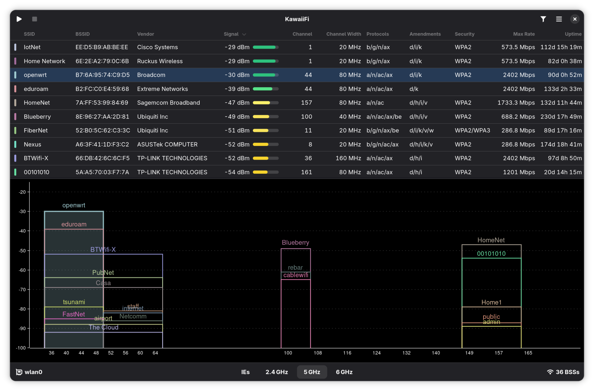

<p align="center">
  
</p>

<h1 align="center">KawaiiFi</h1>

<p align="center">
  A Wi-Fi scanner for Linux built with GTK4/libadwaita
</p>

<p align="center">
  <a href="https://github.com/zleytus/kawaiifi/actions/workflows/ci.yml"></a>
  <a href="LICENSE"></a>
  
  
</p>

<p align="center">
  
</p>

## Dependencies

- [Meson](https://mesonbuild.com/) >= 1.4
- [Rust](https://www.rust-lang.org/) (stable)
- GTK4
- libadwaita
- [blueprint-compiler](https://gitlab.gnome.org/GNOME/blueprint-compiler)
- NetworkManager

## Building

Set up the build directory (run once, or when `meson.build` files change):

```sh
meson setup builddir --prefix=~/.local
```

Compile assets (run after changing `.blp` files or other non-Rust assets):

```sh
meson compile -C builddir
```

## Running

For Rust-only changes, you can run directly with Cargo after assets have been compiled:

```sh
APP_ID=fi.kawaii.kawaiifi RESOURCES_FILE=builddir/data/resources/resources.gresource GSETTINGS_SCHEMA_DIR=builddir/data cargo run
```

To do a full install:

```sh
meson install -C builddir
```

## License

KawaiiFi is licensed under GPL-3.0-or-later.
